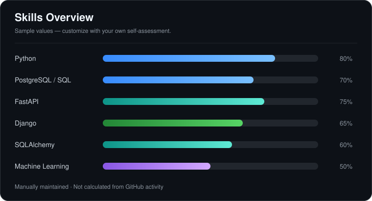

# Hi, I'm Mohsen 👋

**Python Backend Developer · Data Science Student**

I build backend systems with Python and explore machine learning and deep learning.
Most of my work lives in private repositories.

### Tech Stack

### Skills Overview

<!-- Sample scores: edit assets/skills.svg to reflect your own assessment. -->

### Most Used Languages

Language statistics reflect supported public repositories, not proficiency.
Private repositories are not included in this public card.

